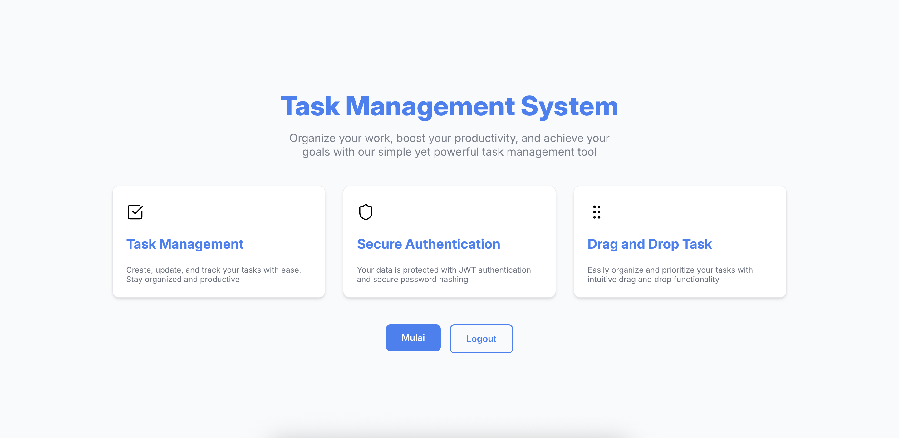
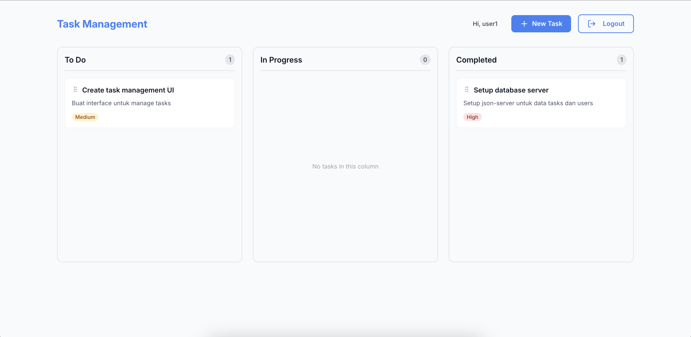

# Task Management System

<div style="display: grid; grid-template-columns: repeat(2, 1fr); gap: 16px;">
  
  
</div>

<br />

A modern, intuitive task management application built with React and TypeScript. Organize your work, boost your productivity, and achieve your goals with drag-and-drop functionality.

## Features

- **Task Management** - Create, update, and track your tasks with ease
- **Secure Authentication** - Your data is protected with JWT authentication
- **Drag and Drop** - Easily organize and prioritize your tasks with intuitive drag and drop
- **Responsive Design** - Works seamlessly on desktop, tablet, and mobile devices
- **Real-time Updates** - Optimistic UI updates for better user experience

## Tech Stack

### Frontend
- **React 19.2.3** - A JavaScript library for building user interfaces
- **React Router 7.10.1** - Declarative routing for React applications
- **TypeScript** - Static type checking for JavaScript
- **Styled Components 6.1.19** - CSS-in-JS styling with theme support
- **React Hook Form 7.68.0** - Performant, flexible forms with validation

### Drag and Drop
- **@dnd-kit/core** - Modern drag and drop toolkit for React
- **@dnd-kit/utilities** - Utility functions for drag and drop

### UI/UX
- **Lucide React 0.561.0** - Beautiful, consistent icon library

### Authentication
- **jwt-decode 4.0.0** - Client-side JWT token decoding
- **Axios** - HTTP client for API requests

## Prerequisites

Before running this project, make sure you have:

- **Node.js** (version 20 or higher)
- **pnpm** (recommended) or npm

## Installation

1. Clone the repository:
```bash
git clone <repository-url>
cd task-management
```

2. Install dependencies:
```bash
pnpm install
```

## Running the Project

### Development Mode

Start the development server:

```bash
pnpm run dev
```

The application will be available at `http://localhost:5173` (or the port shown in your terminal).

### Build for Production

Create a production build:

```bash
pnpm run build
```

### Preview Production Build

Preview the production build locally:

```bash
pnpm run start
```

## Project Structure

```
task-management/
├── app/
│   ├── components/         # Reusable UI components
│   │   └── ui/             # Base UI components (Button, Input, Modal, etc.)
│   ├── features/           # Feature-based modules
│   │   ├── auth/           # Authentication features
│   │   ├── home/           # Home page and landing
│   │   └── task/           # Task management features
│   │       ├── components/ # Task-specific components
│   │       ├── context/    # Task context for state management
│   │       ├── pages/      # Task pages
│   │       └── types/      # TypeScript type definitions
│   ├── lib/                # Utility functions and configurations
│   ├── routes/             # Route definitions
│   └── styles/             # Global styles and theme
├── public/                 # Static assets
└── README.md               # Project documentation
```

## Environment Variables

Create a `.env` file in the root directory (if needed):

```env
VITE_API_BASE_URL=your_api_base_url_here
```

## Key Features Details

### Authentication
- Login and registration with JWT tokens
- Protected routes for authenticated users
- Token-based session management

### Task Management
- Create, read, update, and delete tasks
- Organize tasks by status: To Do, In Progress, Completed
- Drag and drop tasks between columns
- Priority levels: Low, Medium, High
- Task descriptions and metadata

### Responsive Design
- Mobile-first approach
- Breakpoints: 640px (sm), 768px (md), 1024px (lg), 1280px (xl)
- Adaptive layouts for different screen sizes
